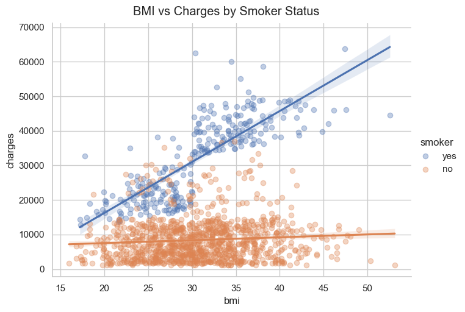

# 

# Factors Influencing Healthcare Insurance Cost 

This project looks at how personal factors (e.g. gender, age, BMI, smoking status) and geographical location (region of the USA) may impact on medical insurance costs. The aim is to analyse the dataset and identify which factors significantly increase healthcare insurance costs.

## Dataset Content
* The dataset was taken from Kaggle and contains anonymised personal information of people in the USA that have taken out medical insurance. https://www.kaggle.com/datasets/willianoliveiragibin/healthcare-insurance
* Personal information includes age, gender, BMI, number of children, smoking status and their geographical location in the USA. Additionally, the cost of their medical insurance. 

## Business Requirements
* Analyse dataset to identify potential factors influencing medical insurance costs for customers. 
* The findings will assist in the data driven decision on pricing strategies and cost estimation. 

## Hypothesis and how to validate?
* People with a smoking habit (smokers) are likely to pay more for medical insurance than non-smokers.
* A person with high BMI will pay more for medical insurance compared to lower BMI person.
* Older people will pay more for medical insurance compared with younger individuals.
* Geographic location should not impact on the cost of the medical insurance.
* The number of children in the family will have no impact the cost of medical insurance.
* The gender of the individual will have an impact on the medical insurance cost.
* A smoking person also having a high BMI will pay more for medical insurance 

I will use visualisation tools like Matplotlib and Seaborn to clearly show the factors impacting medical insurance costs. Additionally, I will use PowerBI to create a interactive dashboard page. I will also look at a baseline linear regression model. 

## Project Plan
* Data collection and set up: The data was taken from Kaggle and saved as CSV file (RawData folder). This data was loaded in VS Code.
* Data cleaning: The data extraction, transformation and loading (ETL) was completed. The data was reviewed for duplicates, outliers, missing values. The data cleaning was completed (CleanData folder) analysis was commenced. 
* Data analysis and visualisation was completed using Matplotlib and Seaborn. The data presented using box-plots and scatter plots. Chart types were chosen based on data distribution.
* The kanban board link is https://github.com/users/ahmedf-bot/projects/1 
* The interactive dashboard page was created using PowerBI.

## The rationale to map the business requirements to the Data Visualisations
* The aim is to identify which factors impact the medical insurance cost for customers in the USA. Matplotlib visualisation tool was used to clearly identify the patterns and test the hypothesis questions.

1/ Smokers pay more for medical insurance vs non smokers. 
The box plot visualisation used and dashboard page clearly shows that smokers pay significantly more than non-smokers. 

2/ Having a high BMI and smoking increase medical insurance cost. 
The scatter plot visualisation used and dashboard page clearly shows that being a smoker and having also having a high BMI means they pay more compared to a non-smoker with low BMI.

3/ Medical insurance cost increase with age. 
The scatter plot visualisation shows a the older you get the more you pay for medical insurance. There is gradual increase in cost with increase in age of the person. 

4/ Region does not impact insurance cost. 
The box plot visualisation and dashboard page shows that region has very little impact on costs. All four regions have a similar median value. 

5/ Number of children a person have does not impact on medical insurance cost. The box plot visual shows no impact on insurance cost. 

## Analysis techniques used
* I used visualisation tools (Matplotlib and Seaborn) to analyse my dataset and identify which factors increased medical insurance costs. 
* I used box plots to show that smokers pay higher medical insurance compared to non-smokers.
* I used a scatter plot to show increasing age is linked to higher medical insurance cost i.e. the older you get the more you pay for insurance. 
* I used scatter plots to show correlation between a smoker and high BMI resulting in higher cost for medical insurance. 
* I used a baseline linear regression model to assess linear fit quality. 

* I used Co-pilot to help as required.

## Ethical considerations
* The data was sourced from Kaggle, a Google-owned online platform offering datasets, and tools to learn, practice, and collaborate on real-world data challenges. 
* The dataset does include anonymised personal information so needs to be handled carefully and used solely for the purpose of this data analysis. The data was handled using transparent data practices. 
* Data handling was in accordance with GDPR and ethical guidelines. 

## Dashboard Design
* The dashboard page was developed using PowerBI to assits in understanding and allow the analysis of factors that impact healthcare insurance costs in four reagions of the USA. https://app.powerbi.com/groups/me/reports/68c2a1a1-73ea-4c41-a79c-8679a19af5aa/641e99bd96c46f677cab?experience=power-bi
* The dashboard has various graphs (e.g. scatter plot, line plots and histograms) and buttons to drill down on the data looking at impact of smoker status, BMI, sex and by region.  
* In the dashboard page I have used simple smoker yes and no button, male vs female button to explain the impact on insurance cost to both technical and non-techincal audiences. 
* The dashboard page also communicates complex data insight using a scatter plot. The scatter plot shows a positive correlation between BMI and insurance cost.  

## Unfixed Bugs
* As this is my first project and I am new to data analysis I did use Co-Pilot for code. 
* I had gaps in coding knowledge and AI assistance was helpful.

## Development Roadmap
* Faced challenge using VS code to load the CSV file.
* Folder and file structure not recognised and needed to restart the kernal.
* I used the LMS to review past lesson to refresh my knowledge.
* I also asked for help from my tutor.
* Also using CoPilot to help
* I would like learn more on using VS code, PowerBI and using the Jupyter notebook more proficiently. 

## Conclusion
In this project using the healthcare insurance dataset I was able to identify using visual analysis that smoking, high BMI and old age will significantly raise the cost of medical insurance. Smoking status had the strongest impact. Additionally, if you are a smoker and also have a high BMI you will pay significantly more compared to non-smoker with a low BMI. The geographical region and number of children does not appear to impact the insurance cost. 

The matplotlib visualisation and Dashboard page clearly showed the patterns and I was able to identify the factors that impact insurance cost. 

This project allowed me to develop my data analysis skills and put it into action in VS code and create a dashboard page using PowerBI. I learnt data cleaning, using data visualisation tools and making data driven conclusions. 

## Main Data Analysis Libraries
I used the following libraries for data analysis: pandas, numpy, matplotlib and seaborn. 

## Credits 

* Kaggle was the source of the raw data.
* PowerBI was used to create a interactive dashboard page.  
* The use of Co-Pilot helped in generating code and providing explanations.
Additionally, support was provided when required by Code Institute course monitor (Vasi) 

## Acknowledgements
Thank you to Vasi for all the help during the project.